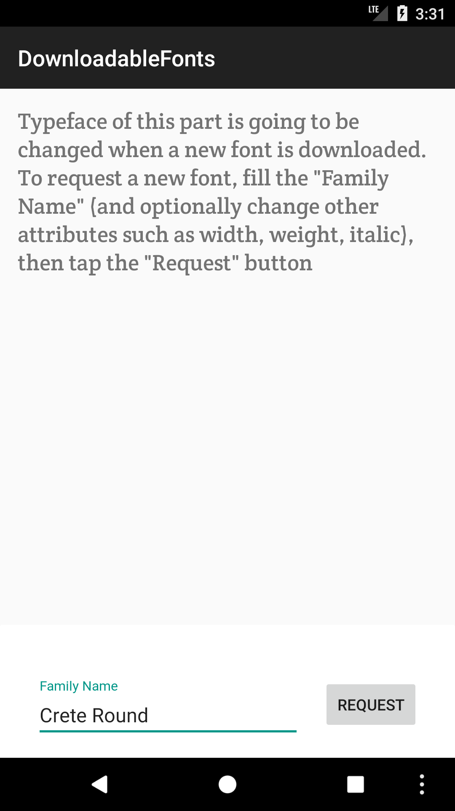

# DownloadableFonts Sample

This sample demonstrates how to use the Downloadable Fonts feature introduced in Android O. Downloadable Fonts is a feature that allows apps to request a certain font from a provider instead of bundling it or downloading it themselves. This means, there is no need to bundle the font as an asset.

## Instructions

There are two ways of requesting a font to download:
- Request a font to download from C# code
- Declare a downloaded font in an XML file

## Build Requirements
Using this sample requires the Android 8.0 (API 26) and the Xamarin.Android 7.5.x or higher.

## Authors
Copyright (c) 2017 The Android Open Source Project, Inc.  
Ported from [Android DownloadableFonts Sample](https://github.com/googlesamples/android-DownloadableFonts).  
Ported to Xamarin.Android by Gonzalo Martin.