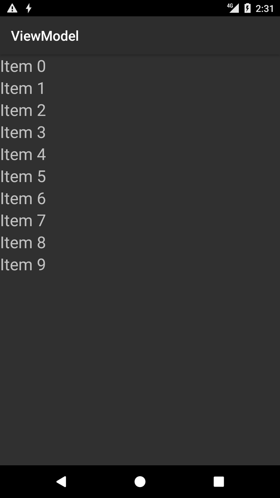

# ViewModel Sample

This sample demonstrates usage of ViewModel and LifeCycle [Architecture Components](https://developer.android.com/topic/libraries/architecture/index.html) library by Android.

## Build Requirements

Using this sample requires the Android 8.1 (API 27) and the Xamarin.Android 8.2 or higher.

## Authors

Copyright (c) 2018 The Android Open Source Project, Inc.

Ported to Xamarin.Android by Gonzalo Martin
