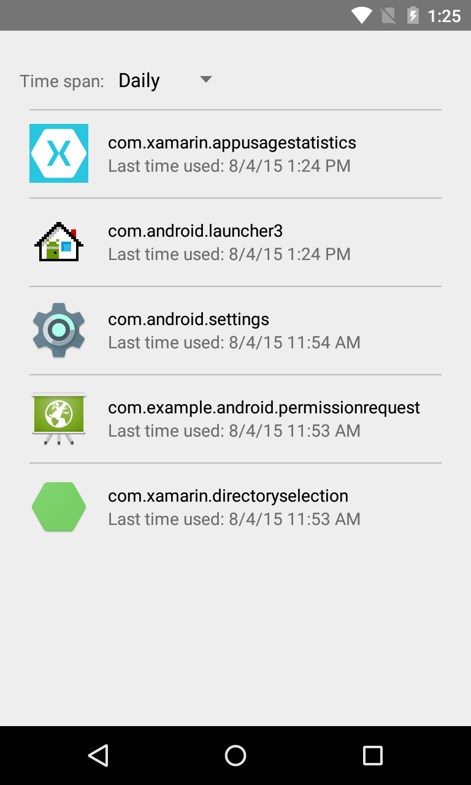
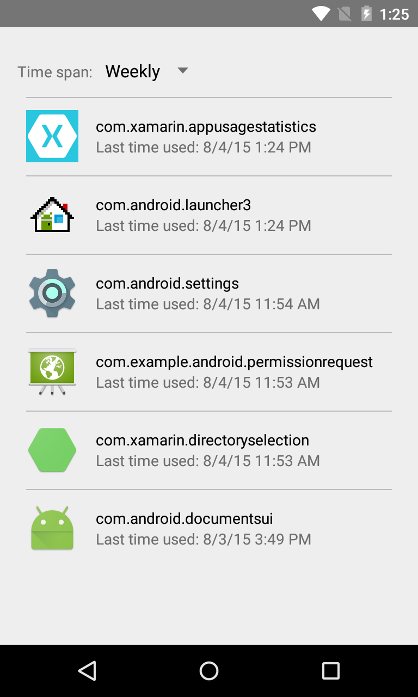

# App Usage Statistics Sample

This sample shows how to use the App usage statistics API to let users collect statistics related
to usage of the applications.

## Introduction

The App usage statistics API allows app developers to collect statistics related to usage of
the applications. This API provides more detailed usage information than the deprecated
getRecentTasks() method.

This example illustrates how to use the App usage statistics API by showing the applications sorted
by the timestamp of the last time each app was used.

## Instructions

* If it exists, tap on the "Open Apps with usage access settings" button and grant permission to access app usage statistics
* Tap on the drop down list and select an interval
* View basic usage statistics for apps on the device

## Build Requirements
Using this sample requires the Android SDK platform for Android 5.0 (API level 21).

## Screenshots

 

## Authors
Copyright (c) 2014 The Android Open Source Project, Inc.

Ported from [Android AppUsageStatistics Sample](https://github.com/googlesamples/android-AppUsageStatistics)

Ported to Xamarin.Android by Dylan Kelly
