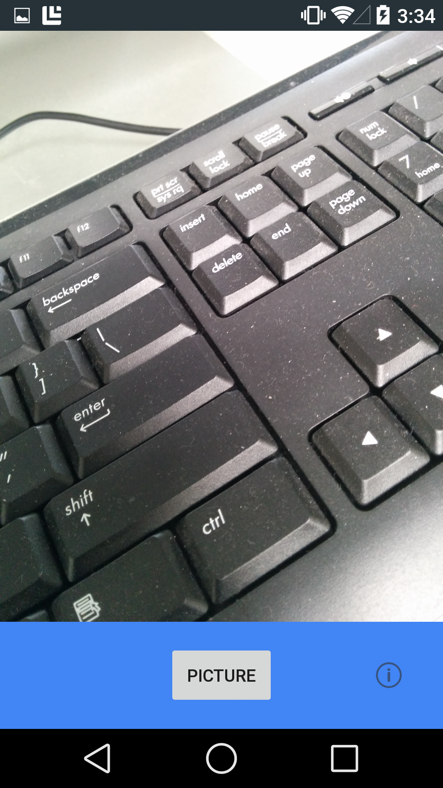

# Xamarin.Android Camera2 Basic Sample

This sample demonstrates how to use the new Camera2 APIs to render a preview of a camera's viewport, capture an image and save it to the device's storage.

## Instructions

- Touch the Picture button to take a photo that will automatically be saved on your device.

- Touch the info button to find out a little bit more about the app.

- Requires a device with a rear facing camera

## Build Requirements

Using this sample requires a device that is Android L or later and Xamarin.Android 4.17 or later.

## License

Original copyright (c) 2005-2008, The Android Open Source Project  
