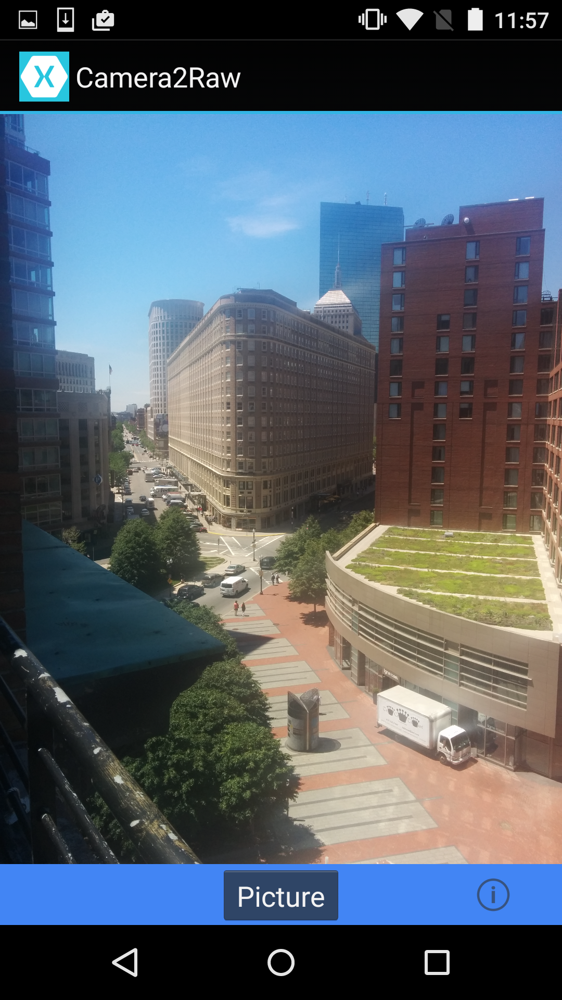

# Xamarin.Android Camera2Raw Sample

This sample demonstrates how to use the Camera2 APIs to capture RAW camera buffers and save them to the devices storage as a dng file.

## Instructions

- Touch the Picture button to take two photos that will automatically be saved on your device.
- Touch the Info button to find out a little bit more about the app.
- Requires a device with a rear facing camera

## Build Requirements

Using this sample requires a device that is Android 5.0 or later and Xamarin.Android 5.0 or later.

## License

Original copyright (c) 2014 The Android Open Source Project, Inc.

Ported from [Android Camera2Raw Sample](https://github.com/googlesamples/android-Camera2Raw)
