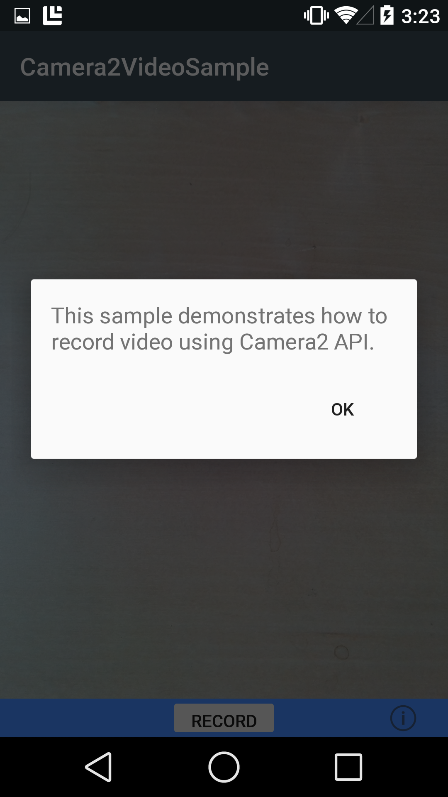

# Xamarin.Android Camera2Video

This sample demonstrates how record video on Android L through the use of the Android.Hardware.Camera2 namespace.

## Instructions

* Touch the Record button to begin recording video.
* Touch the Stop button to stop recording video and save the video.
* Touch the Info button to display some more information on the app.
* Requires a device with a rear facing camera

## Build Requirements

Using this sample requires a device that is Android L or later and Xamarin.Android 4.17 or later.

## Notes

This sample is known to crash on various device and Lollipop version combinations. See https://github.com/googlesamples/android-Camera2Video/issues/2 for more info.

## License

Original copyright (c) 2005-2008, The Android Open Source Project  
