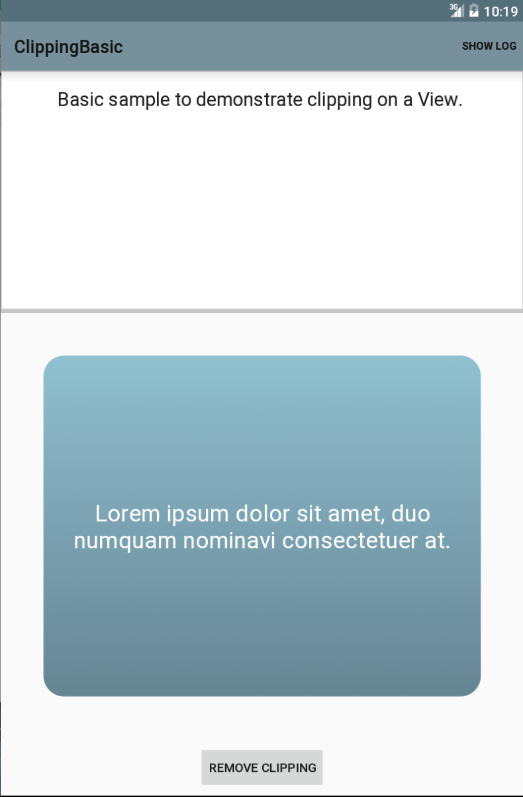

# ClippingBasic
This sample demonstrates simple clipping in Android L.

## Instructions

* Touch the Show Log/Hide Log button to toggle the log.
* Touch the text to cycle through three different strings.
* Touch the Clip/Remove Clipping button to toggle the clipping of the text.

## Build Requirements
Using this sample requires a device that is Android L or later and Xamarin.Android 4.17 or later.

## Author
Copyright (c) 2005-2008, The Android Open Source Project  
Ported to Xamarin.Android by John Pilczak
