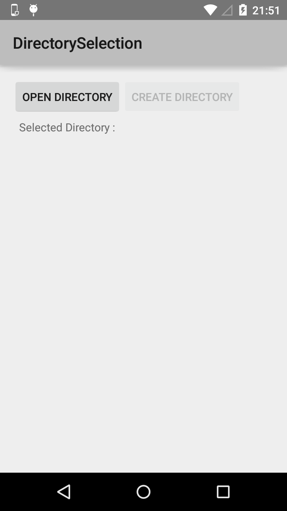
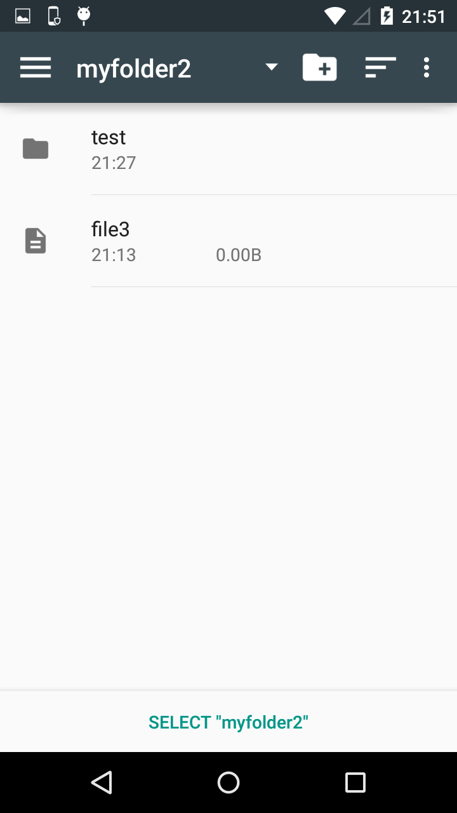
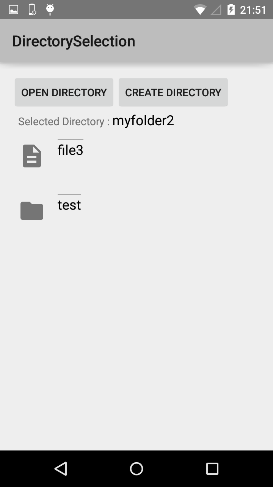
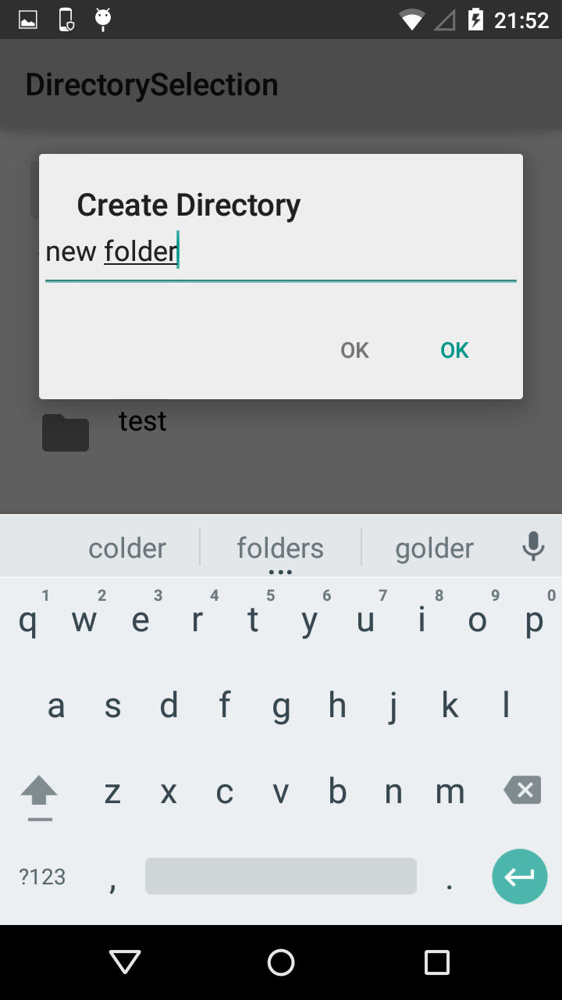
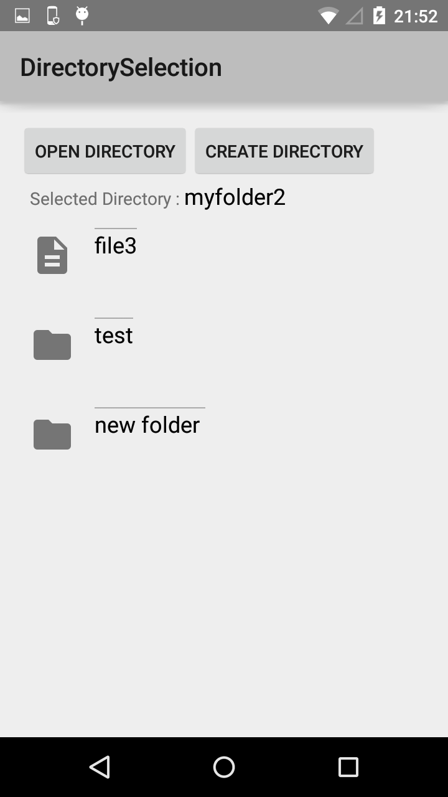

Directory Selection Sample
==========================

This sample shows how to use the Directory Selection API to let users select an entire directory subtree, which extends the Storage Access Framework introduced in Android 4.4 (API level 19).

Introduction
------------

The Directory Selection API, which was introduced in Android 5.0 (API level 21) extends the Storage Access Framework to let users select an entire directory subtree,
giving apps read/write access to all contained documents without requiring user confirmation for each item.

Instructions
------------

* Tap on the "Open Directory" button
* Select any directory
* Observe the app displaying the contents of the folder
* Tap on the "Create Directory" button, create a directory with any name
* Observe the newly created directory being listed in addition to the already existing contents

Build Requirements
------------------
Using this sample requires the Android SDK platform for Android 5.0 (API level 21).

Screenshots
-------------

     

Authors
-------
Copyright (c) 2014 The Android Open Source Project, Inc.

Ported from [Android DirectorySelection Sample](https://github.com/googlesamples/android-DirectorySelection)

Ported to Xamarin.Android by Dylan Kelly
