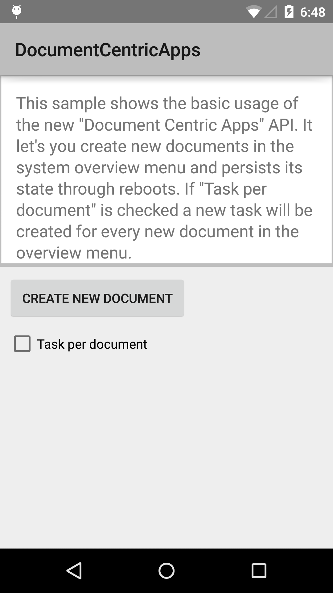

# DocumentCentricApps

This sample demonstrates the basic usage of the new Document-Centric Apps API.

## Instructions

* Run the project
* Tap the Create New Document button to show a new document activity.
* Enable the Task per document checkbox to make it so that each document is a new document in the task manager.

## Build Requirements
* Xamarin Studio 5.3+
* Xamarin Android 4.20+
* Android SDK v21

## Author 
Copyright 2014 The Android Open Source Project

Ported to Xamarin.Android by John Pilczak
