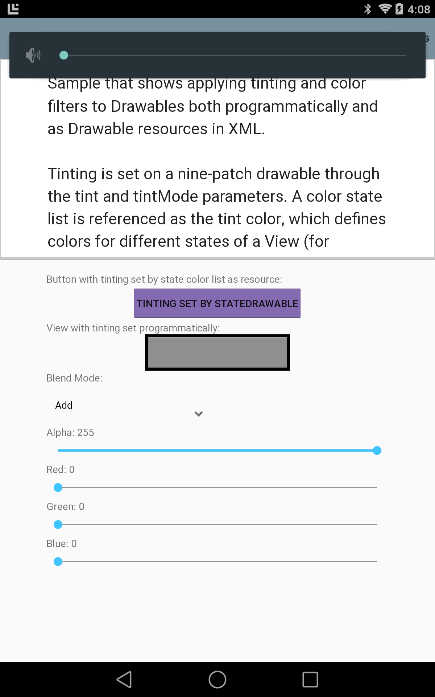

# Drawable Tinting

Sample that shows applying tinting and color filters to Drawables both programmatically and as Drawable resources in XML

Tinting is set on a nine-patch drawable through the "tint" and "tintMode" parameters.A color state list is referenced as the tint color, which defines colors for different states of a View (for example disabled/enabled, focused, pressed or selected).

Programmatically, tinting is applied to a Drawable through its "setColorFilter" method, with a reference to a color and a PorterDuff blend mode. The color and blend mode can be changed from the UI to see the effect of different options.

## Instructions

* Run the project
* Adjust the sliders and tint mode and see how it affects the images on the screen
* To see the log output, tap the Show Log button

## Build Requirements
* Xamarin Studio 5.3+
* Xamarin Android 4.17+
* Android SDK (L Preview)

## Author 
Copyright 2014 The Android Open Source Project

Ported to Xamarin.Android by John Pilczak
