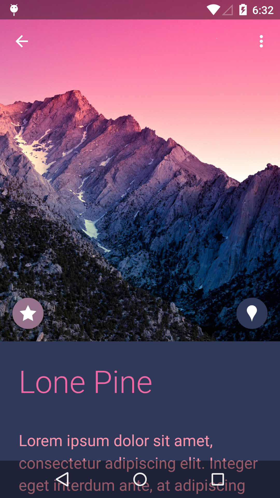

# Google I/O 2014

This sample demonstrates the new Material Design APIs introduced in Android Lollipop, including:

* Custom theme colors
* Dynamic palette
* Circular reveal
* Activity transitions

## Notes
In order to properly display maps, edit the following meta-data in AndroidManifest.xml to include your own Mapsv2 Api Key:
* <meta-data android:name="com.google.android.maps.v2.API_KEY" android:value="YOUR_KEY_HERE" /

## Instructions

* Navigate back and forth between main and detail views to display animations.
* Tap any list element to display a detailed view.
* Tap the location button to display a map (after entering an Api Key).
* Tap the star button to see a 'favorited' animation.

## Build Requirements
Using this sample requires the Android SDK platform for Android 5.0 (API level 21).

## Authors
Copyright (c) 2014 The Android Open Source Project, Inc.

Ported from [Material Witness](https://github.com/romainguy/google-io-2014)

Ported to Xamarin.Android by John Pilczak and Aaron Sky
