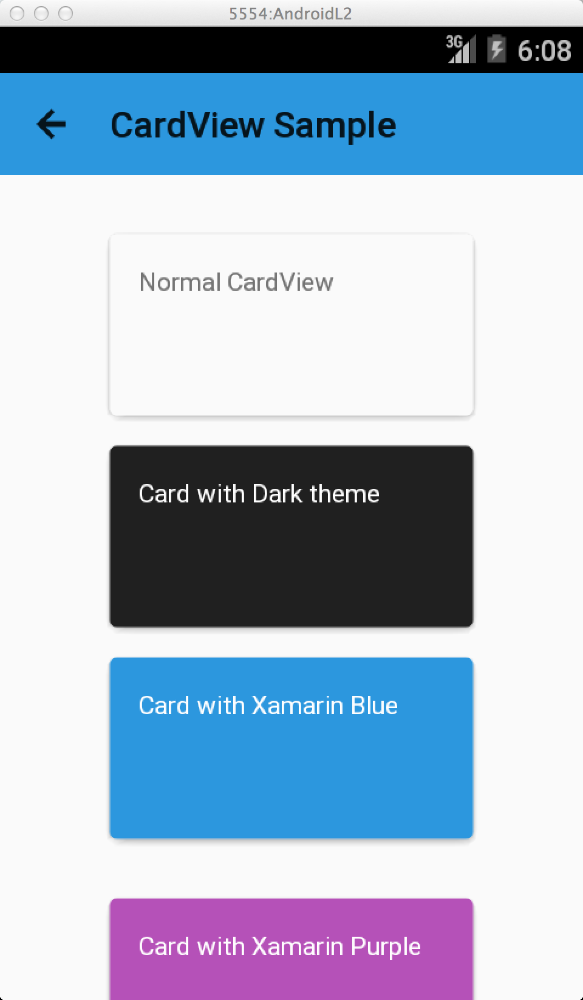

# Android L Kitchen Sink

Basic samples of new Android L features including support v7.

## Features
* Activity Transitions
* CardView
* Elevation
* RecyclerView
* Material Themes
* Tinting
* Lollipop Notifications
* Palette
* Reveal

## Build Requirements
* Xamarin Studio 5.5+
* Xamarin Android 4.20+
* Android SDK with Android 5.0

## Author 
Copyright 2014 Xamarin

Created by James Montemagno
