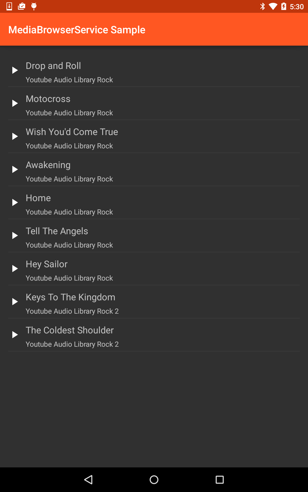

# MediaBrowserService

This sample demonstrates how to implement a media player app the new MediaBrowserService API introduced in Android Lollipop. MediaBrowserService exposes a system-standard media-playing interface that is usable with notifications, Android Auto, and between apps.

## Build Requirements

Using this sample requires the Android SDK platform for Android 5.0 (API level 21).

## License

Copyright (c) 2014 The Android Open Source Project, Inc.

Ported from [Android MediaBrowserService Sample](https://github.com/googlesamples/android-MediaBrowserService)
