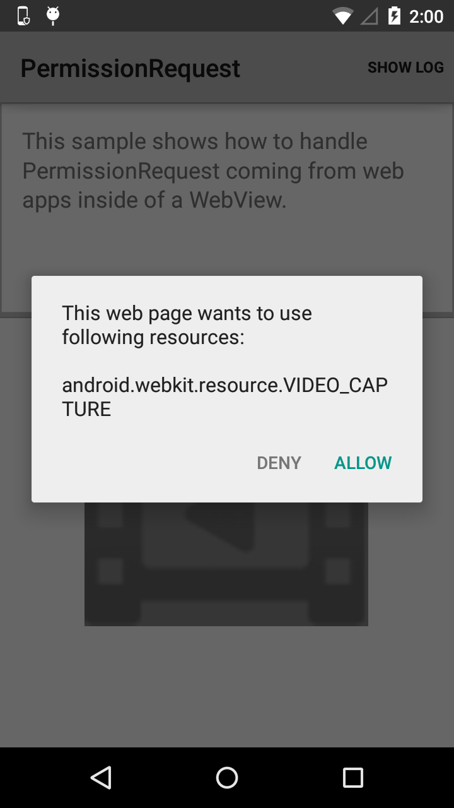

# Permission Request Sample

This sample demonstrates how to use the PermissionRequest API to
securely provide access to restricted system features (such as a
camera or microphone) from within a WebView. In this example, a dialog
is created to allow users to explicitly approve or reject each
request.

## Introduction

PermissionRequest can be used by setting up a custom WebChromeClient.

```csharp
mWebView.SetWebChromeClient(mWebChromeClient);
```

In you WebChromeClient implementation, you need to override
OnPermissionRequest. This method is called when the web content
is requesting permission to access some resources, providing an
opportunity to approve or reject the request. In this implementation,
we display a dialog to allow the user to approve or reject any
request. In other applications, you may want to implement a whitelist
of allowed APIs.  Also, override OnPermissionRequestCanceled for
handling cancellation of the PermissionRequest by the web content.

When the user confirms or denies the request, you can respond back to
the web content by grant or deny respectively.

## Instructions

* Tap on the "Start" button
* Grant permission for android.webkit.resource.VIDEO_CAPTURE
* Observe camera turn on
* Tap on the "Stop" button
* Tap on the "Start" button
* Do not grant permission for android.webkit.resource.VIDEO_CAPTURE
* Observe camera does not turn on

## Build Requirements

Using this sample requires the Android SDK platform for Android 5.0 (API level 21).

## Screenshots



## License

Copyright (c) 2014 The Android Open Source Project, Inc.

Ported from [Android PermissionRequest Sample](https://github.com/googlesamples/android-permissionRequest)
