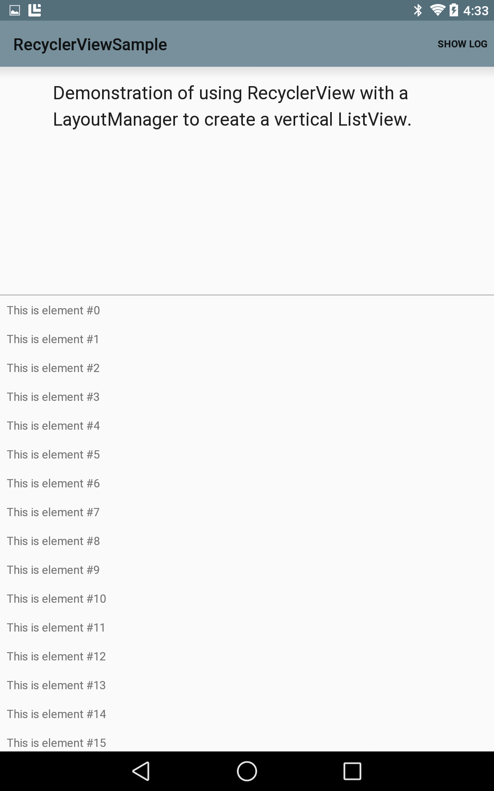

# RecyclerView

Demonstration of using RecyclerView with a LinearLayoutManager to create a vertical ListView.

## Instructions

* Run the project
* Tap the Show Log button to show the log
* Scroll through the elements and watch the log to see the RecyclerView in action.

## Build Requirements
* Xamarin Studio 5.3+
* Xamarin Android 4.17+
* Android SDK (L Preview)

## Author 
Copyright 2014 The Android Open Source Project

Ported to Xamarin.Android by John Pilczak
