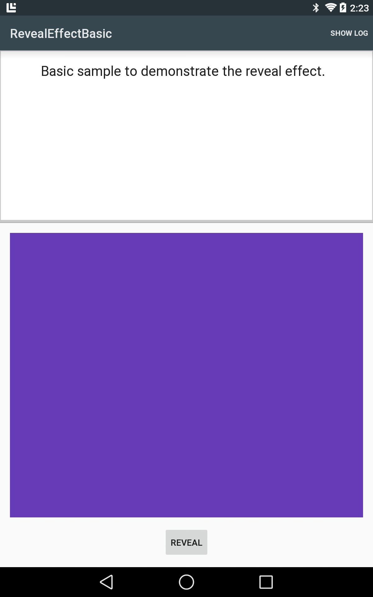

# Reveal Effect Basic

Basic sample to demonstrate the reveal effect.

## Instructions

* Run the project
* Click on the "Reveal" button to demonstrate the reveal effect on the purple square.

## Build Requirements

* Xamarin Studio 5.3+
* Xamarin Android 4.17+
* Android SDK (L Preview)

## License

Copyright 2014 The Android Open Source Project
