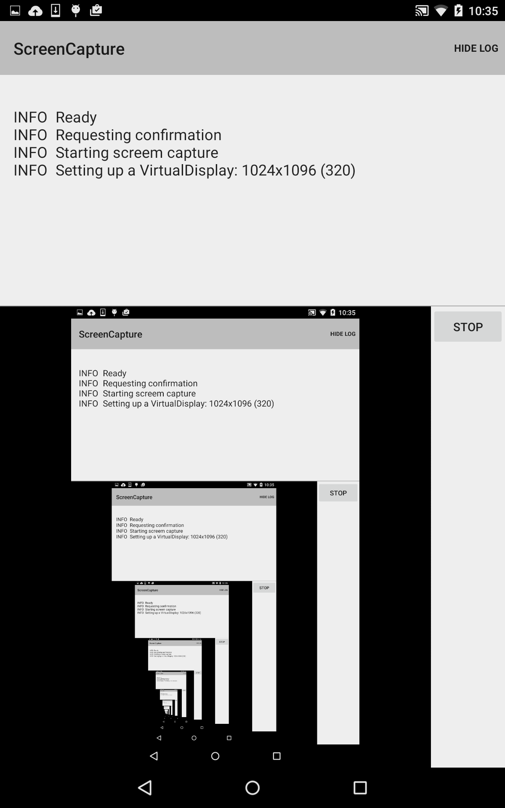

# ScreenCapture

This sample demonstrates how to use Media Projection API to capture device screen in real time and show it on a SurfaceView.

## Instructions

* Launch the app on a Lollipop device or emulator.
* On devices with display widths under 720dp, tap the Show Log button to show the sample's log.
* Tap the start button to start capturing the screen and displaying it in the ScreenCaptureFragment's SurfaceView.

## Build Requirements

* Xamarin.Android 4.20
* Android SDK v21
* Android Support Repository
* Android Build Tools v21.1.1

## License

Copyright 2014 The Android Open Source Project, Inc.
