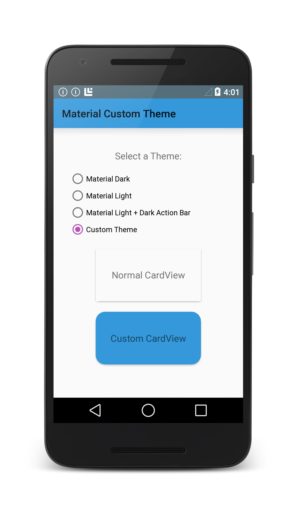

# Android 5.0 Theme Switcher

This examples shows how to use different Android 5.0 Lollipop Material Theme 
styles in different activities, how to create a customized
Material Theme style, and how to theme an individual view.
A companion article is available at
[Material Theme](http://developer.xamarin.com/guides/android/user_interface/material_theme).

## Requirements

To build and run this sample, you must first enable Android 5.0 support as 
described in 
[Setting Up an Android 5.0 Project](http://developer.xamarin.com/guides/android/platform_features/introduction_to_lollipop#settingup).

## Authors
Mark McLemore

