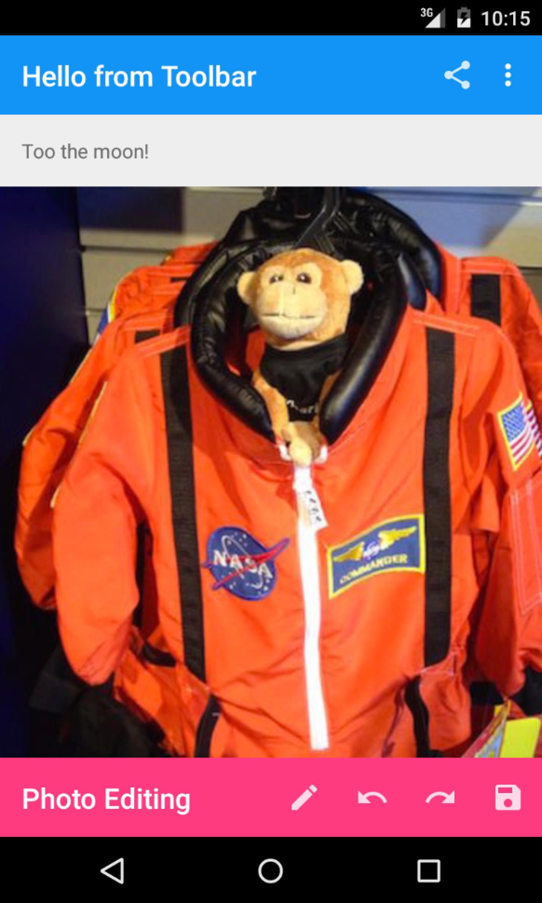

# Toolbar

Basic sample of replacing the ActionBar with the new ToolBar.

## Instructions

* Run the project
* Click on the Toolbar items to see click handlers

## Build Requirements

* Xamarin Studio 5.5+
* Xamarin Android 4.20+
* Android SDK with Android 5.0

## License

Copyright 2014 Xamarin
