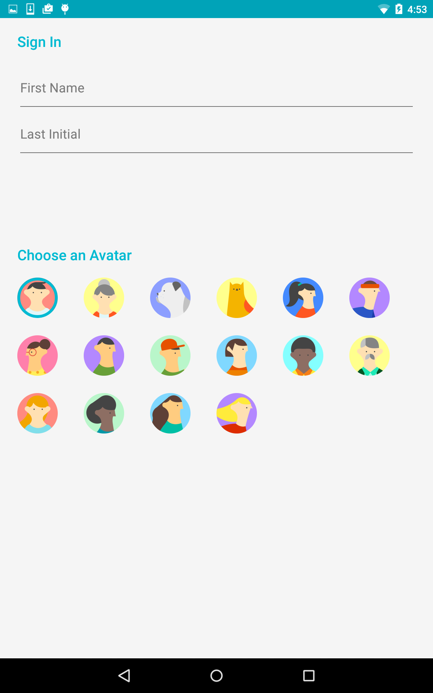
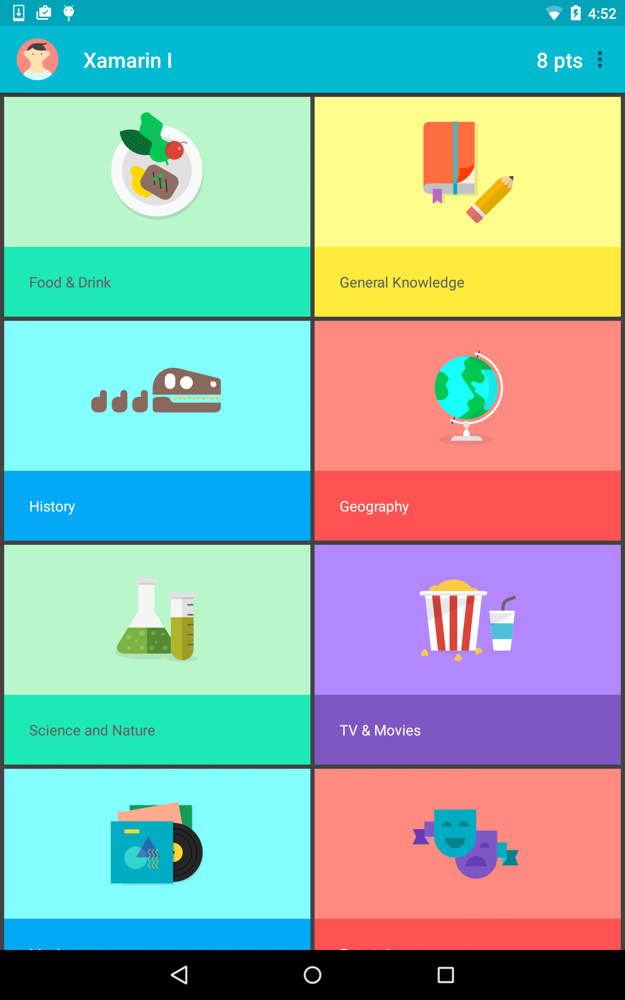

# Topeka for Android

A quiz game that showcases material design on Android. This sample makes use of JSON.NET, SQLite.NET and heavy principles of [Material Design](https://www.google.com/design/spec/material-design/introduction.html). You can read all about the original sample on the [Android Developers blog](http://android-developers.blogspot.co.uk/2015/06/more-material-design-with-topeka-for_16.html).

### Screenshots

### Authors

Copyright (c) 2015 Google, Inc.  
Ported from [Topeka for Android](https://github.com/googlesamples/android-topeka)  
Ported to Xamarin.Android by Aaron Sky  

### CI/CD Edits
