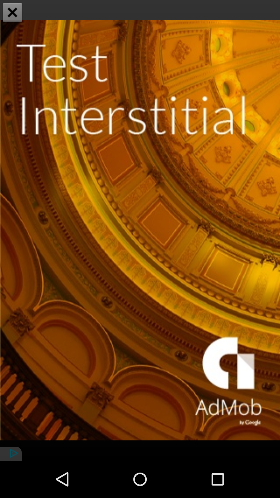

# AdMobExample Sample

This sample demonstrates how to display different types of ads using Google AdMob with Google Play Services.

## Instructions

* Tap the Show Interstitial Ad button to display an ad in between activity transition.

## Build Requirements
Using this sample requires the Android SDK platform for Android 5.0 (API level 21).

## Authors
Copyright (c) 2015 Google, Inc.

Ported from [Google AdMob Quickstart Sample](https://github.com/googlesamples/google-services/tree/master/android/admob)

Ported to Xamarin.Android by Aaron Sky