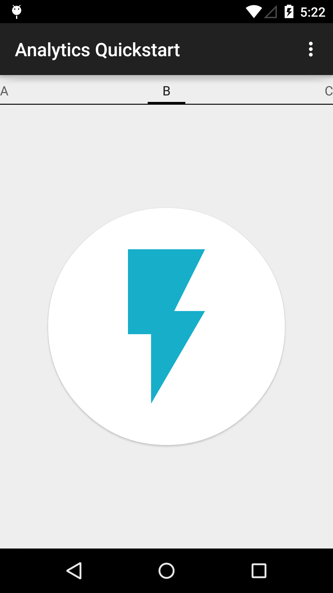

# Analytics Sample

This sample demonstrates how to report screen views to Google Analytics.

## Instructions

* Add your Google Analytics Tracking ID in place of "UA-XXXXXXX-X" in AnalyticsApplication.cs
* Build and run.
* Swipe between images to register screen views.

## Build Requirements
Using this sample requires the Android SDK platform for Android 5.0 (API level 21).

## Authors
Copyright (c) 2015 Google, Inc.

Ported from [Google Analytics Quickstart](https://github.com/googlesamples/google-services/tree/master/android/analytics)

Ported to Xamarin.Android by Aaron Sky