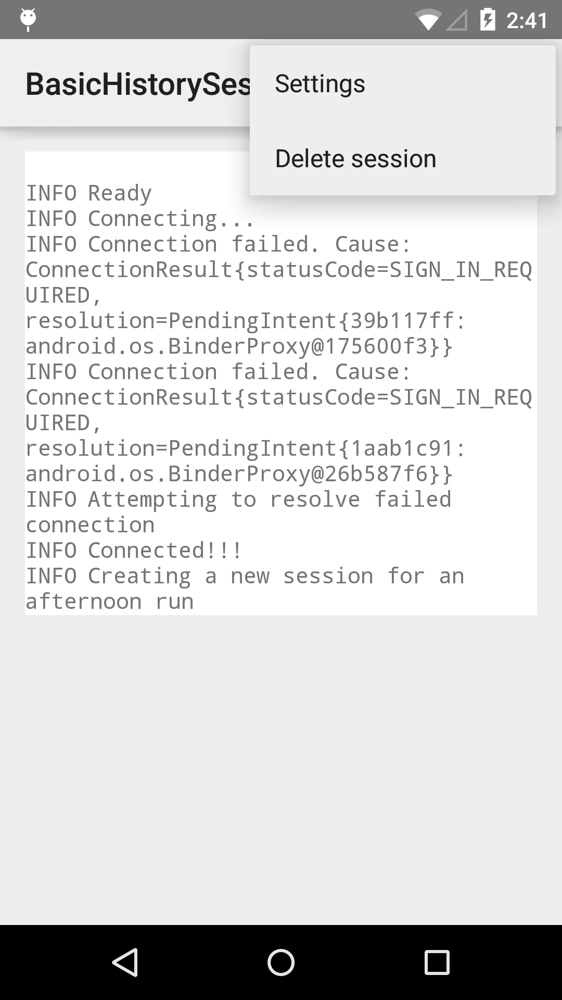

# Android Fit History Api Sessions Sample

This sample demonstrates how to use the Android Fit History API.

## Instructions

* Make sure to enable 'Google Sign-In' for your application via the [Developer Console](https://developers.google.com/mobile/add?platform=android).
* Log into a Google account to display mock session data.

## Build Requirements
Using this sample requires the Android SDK platform for Android 5.0 (API level 21).

## Authors
Copyright (c) 2015 Google, Inc.

Ported from [Android Fit History Api Sessions Sample](https://github.com/googlesamples/android-fit/tree/master/BasicHistorySessions)

Ported to Xamarin.Android by Aaron Sky