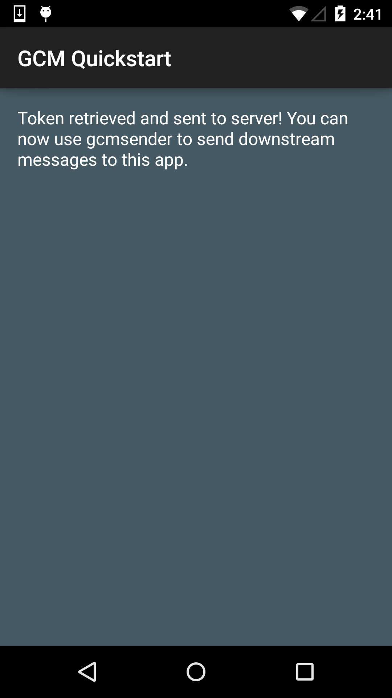

# Google Cloud Messaging Sample

This sample demonstrates how to use Google Cloud Messaging to register an Android app for GCM and handle the receipt of a GCM message.

## Instructions

* Authorize your app in the Google Developers Console (link below) to get your API Key and Sender ID
* Replace the value for `gcm_defaultSenderId` in `GCMSample/Resources/values/strings.xml` with your Sender ID.
* Replace the value for `API_KEY` in `GcmSender/GcmSender.cs` with your API Key.
* Replace all instances of `com.xamarin.gcmquickstart` in the AndroidManifest.xml with your package name (com.yourcompany.______).
* Launch the app and observe it authenticating with the server.
* Send a message using the console application project while the app is still open.
* Observe the notification being sent to your device/emulator.

## Troubleshooting

Note: Make sure you've authorized the app in the [Google Developers Console](https://developers.google.com/mobile/add) before use.

## Build Requirements

Using this sample requires the Android SDK platform for Android 5.0 (API level 21).

## License

Copyright (c) 2015 Google, Inc.

Ported from [Google Cloud Messaging Sample](https://github.com/googlesamples/google-services/tree/master/android/gcm)
