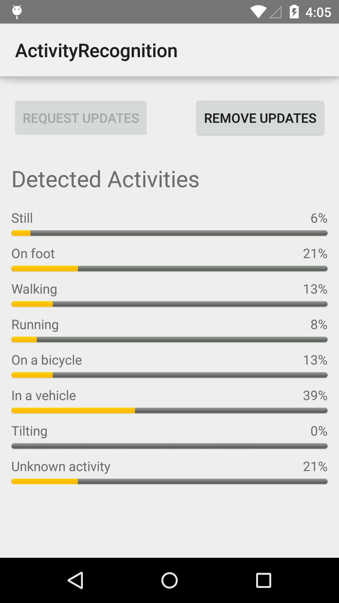

# Activity Recognition Sample

This sample demonstrates how to use the ActivityRecognitionApi to recognize a user's current activity type (e.g. walking, driving, or standing still).

## Instructions

- Tap the "Request Updates" button to begin receiving activity updates.
- While the app is running, update information will begin to populate.
- Tap the "Remove Updates" button to stop receiving updates and clear existing activity data.

## Build Requirements

Using this sample requires the Android SDK platform for Android 5.0 (API level 21).

## License

Copyright (c) 2015 Google, Inc.

Ported from [Recognizing the User's Current Activity Sample](https://github.com/googlesamples/android-play-location/tree/master/ActivityRecognition)
