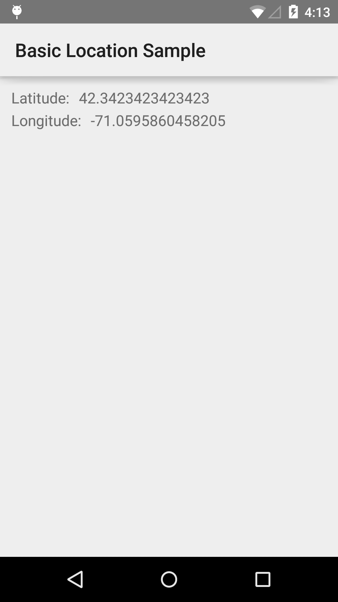

# Basic Location Sample

This sample demonstrates how to use the Google Play services Location API to retrieve the last known location for a device.

## Instructions

* Launch the app to view the last known course location of the device.

## Build Requirements
Using this sample requires the Android SDK platform for Android 5.0 (API level 21).

## Authors
Copyright (c) 2015 Google, Inc.

Ported from [Basic Location Sample](https://github.com/googlesamples/android-play-location/tree/master/BasicLocationSample)

Ported to Xamarin.Android by Aaron Sky