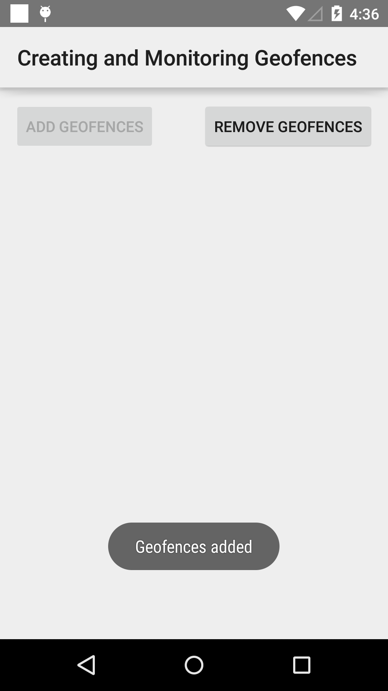

# Geofencing Sample

This sample demonstrates how to create and remove geofences using the GeofencingApi.

## Instructions

- Modify the LatLng dictionary in Constants.cs to include locations near you.
- Launch the app, and tap 'Add Geofences'.
- A notification will be displayed when one of the geofences is entered.

## Build Requirements

Using this sample requires the Android SDK platform for Android 5.0 (API level 21).

## License

Copyright (c) 2015 Google, Inc.
Ported from [Creating and Monitoring Geofences](https://github.com/googlesamples/android-play-location/tree/master/Geofencing)
