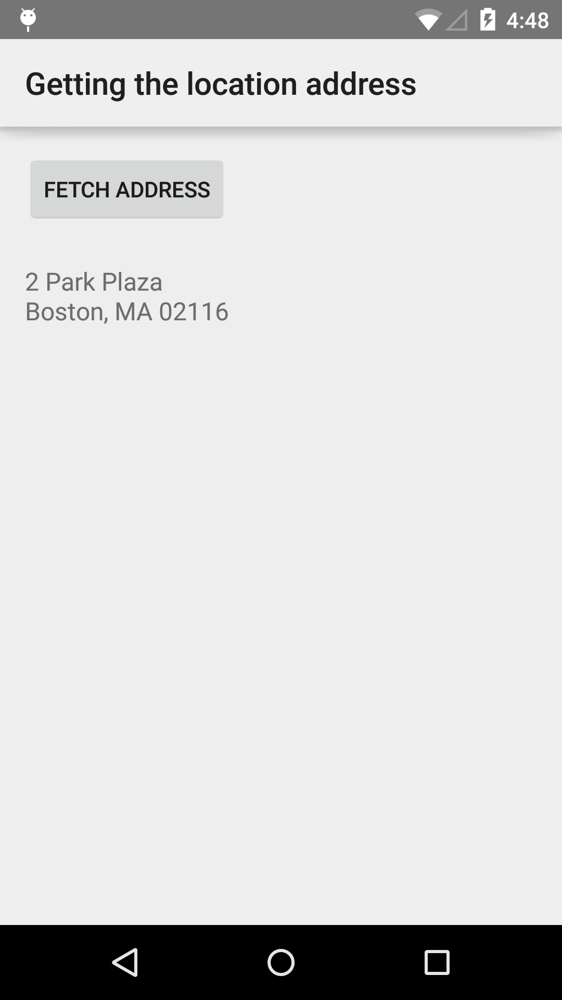

# Location Address Sample

This sample demonstrates how to use the Geocode API and reverse geocoding to display a device's location as an address.

## Instructions

* Tap the "Fetch Address" button to display the nearest address to your current location.

## Build Requirements
Using this sample requires the Android SDK platform for Android 5.0 (API level 21).

## Authors
Copyright (c) 2015 Google, Inc.

Ported from [Location Address Sample](https://github.com/googlesamples/android-play-location/tree/master/LocationAddress)

Ported to Xamarin.Android by Aaron Sky