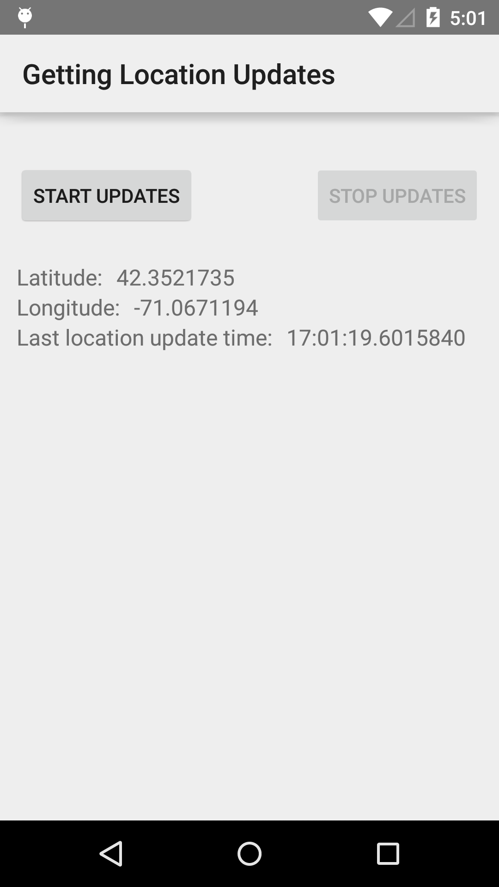

# Location Updates Sample

This sample demonstrates how to use the Fused Location Provider API to get updates about a device's location.

## Instructions

* Tap the "Start Updates" button to start receiving location updates.
* Tap the "Stop Updates" button to stop receiving location updates.

## Build Requirements
Using this sample requires the Android SDK platform for Android 5.0 (API level 21).

## Authors
Copyright (c) 2015 Google, Inc.

Ported from [Location Updates Sample](https://github.com/googlesamples/android-play-location/tree/master/LocationUpdates)

Ported to Xamarin.Android by Aaron Sky