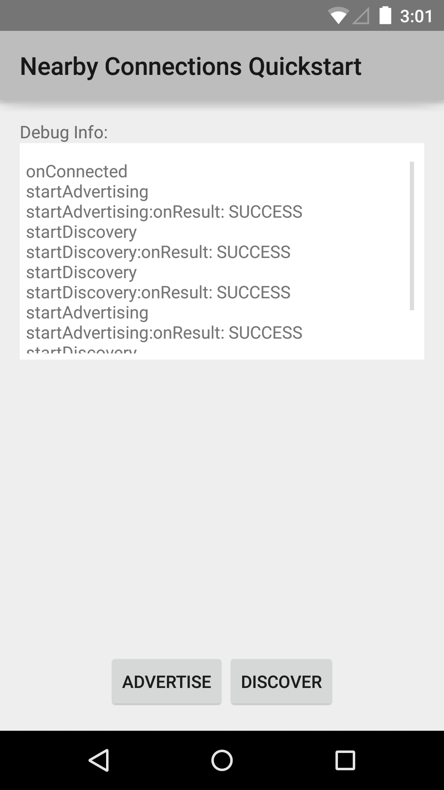

# Nearby Connections Sample

This sample demonstrates how to use the Nearby Connections API to establish a connection between two devices and send messages between them.

## Prerequisites
* Requires two devices running Android 4.4 "KitKat" or higher.

## Instructions

* Tap the "Advertise" button on one device running the app.
* Tap the "Discover" button on the other device running the app in order to discover the first device.

## Build Requirements
Using this sample requires the Android SDK platform for Android 5.0 (API level 21).

## Authors
Copyright (c) 2015 Google, Inc.

Ported from [Nearby Connections Quickstart Sample](https://github.com/googlesamples/android-nearby/tree/master/connections-quickstart)

Ported to Xamarin.Android by Aaron Sky