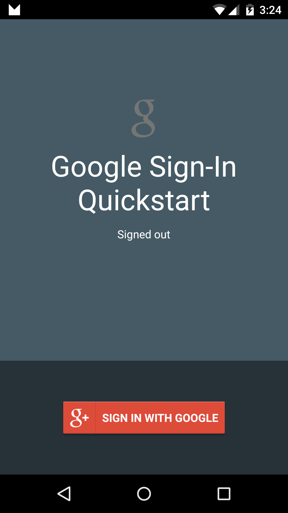

# Google Sign-In Sample

This sample demonstrates how to authenticate a user with the Google Api Client in Google Play Services.

## Setup

* You must follow the next guide to configure the Sign-In feature: https://developers.google.com/identity/sign-in/android/start
* On Step 2 (Configuration File), you can open [this URL](https://developers.google.com/mobile/add?platform=android&cntapi=signin&cntapp=SignInQuickstart&cntpkg=com.xamarin.signinquickstart&cnturl=https:%2F%2Fdevelopers.google.com%2Fidentity%2Fsign-in%2Fandroid%2Fstart%3Fconfigured%3Dtrue&cntlbl=Continue%20with%20Try%20Sign-In) for this specific sample.
* Replace the google-services.json file by your generated file.

## Instructions

* Tap the "Sign in with Google" button to sign in.
* Tap the "Sign Out" button to sign out of the current session.
* Tap "Disconnect" button to disconnect sign in with the app.

## Troubleshooting

* DEVELOPER_ERROR: Make sure you're using the generated android debug keystore by Xamarin for generate SHA-1. Check [this article](https://docs.microsoft.com/xamarin/android/deploy-test/signing/keystore-signature) to get it.

Note: Make sure you've authorized the app in the [Google Developers Console](https://console.developers.google.com/project) before use.

## Build Requirements

Using this sample requires the Android SDK platform for Android 5.0+ (API level 21).

## License

Copyright (c) 2015 Google, Inc.

Ported from [Google Sign-In Sample](https://developers.google.com/mobile/add)
