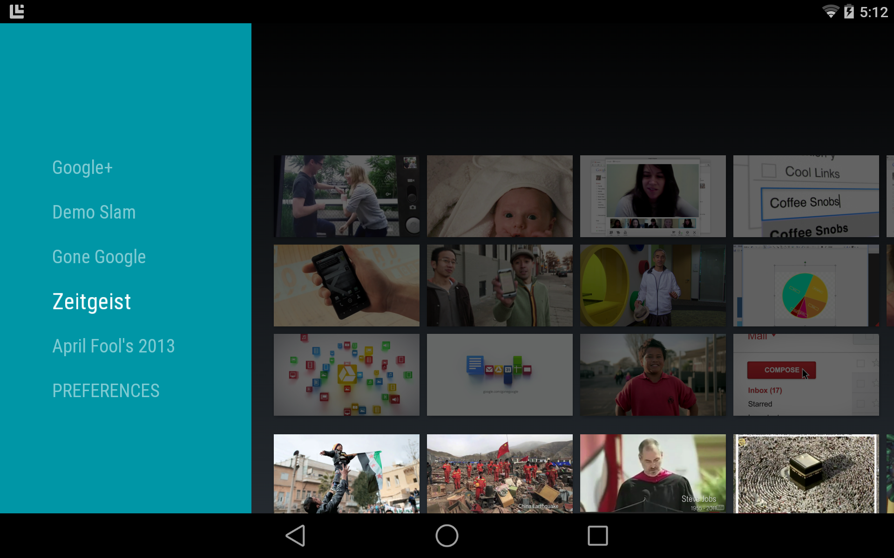

# TvLeanback

This sample shows a basic Android-TV application by showcasing various video provided by Google. 

## Note

This sample may crash due to a [bug](https://code.google.com/p/android/issues/detail?id=73920) in the native Android System.

## Build Requirements

This sample is designed for Android-TV but can run on the Android L developer preview. It also requires Xamarin.Android 4.17+.

## License

This project relies on the Picasso Project by Jake Warton and is used under the Apache License Version 2. The C# bindings used by this app were created by Jack Sierkstra.
The original project by Jake Warton is available from: https://github.com/square/picasso
The bindings are available from: https://github.com/jacksierkstra/Picasso

Copyright (c) 2013, The Android Open Source Project  
