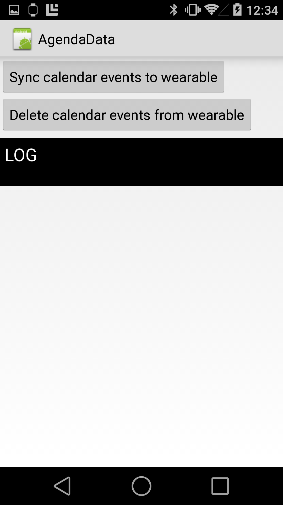

# AgendaData Sample

This sample demonstrates sending calendar events from an Android handheld device to an Android Wear device, as well as deleting those events.

## Instructions

* Launch the AgendaData project onto the phone or tablet and the Wearable project onto the wearable device
* If you have no calendar events on the phone or tablet, make one
* Press the "Sync calendar events to wearable" button to add your calendar events to the wearable
* Press the "Delete calendar events from wearable" to delete the events from the wearable

## Build Requirements

Xamarin Studio 5.3+  
Xamarin.Android 4.17+

## License

Copyright (c) 2005-2008, The Android Open Source Project  
