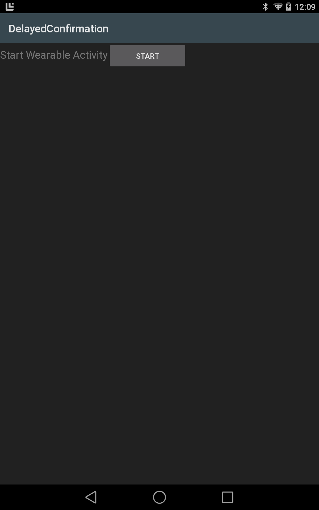

# Delayed Confirmation

A simple sample which demonstrates how to send and receive messages to a connected Wearable using the new Wear APIs. Ported from the Android Open Source Project sample

## Note

For running on an emulator for wearable, you must run
```shell
adb -d forward tcp:5601 tcp:5601
```
Full instructions for how to connect and prepare a Wearable for use please see [Android Developers](http://developer.android.com/training/wearables/apps/creating.html#SetupEmulator)

## Build Requirements

Xamarin.Android 4.17+  
Xamarin Studio 5.3+



## License

Android Open Source Project (original Java)  
