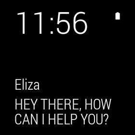

# ElizaChat

A wear sample demonstrating how a personal assistant may work on a wearable device.
The user interacts with Eliza, the personal assistant, through Wear's interactive notifications. The main application serves as a log of the different interactions.

## Note

For running on an emulator for wearable, please run

```shell
adb -d forward tcp:5601 tcp:5601
```

For full instructions for how to connect and prepare a Wearable for use please see [Android Developers](http://developer.android.com/training/wearables/apps/creating.html#SetupEmulator)

## Build Requirements

Xamarin.Android 4.17+  
Xamarin Studio 5.3+



## License

Android Open Source Project (original Java)  
