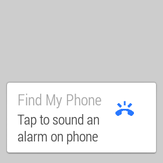

# FindMyPhone
This sample demonstrates a way to create an app that allows you to use your wear device to find your phone.

## Instructions
* Download Xamarin Studio 5.3 or higher and open the project solution. Right click the project “Application” and set it as the startup project, then click build in the application menu. Then right click the project “Wearable”, set it as the startup project, then click build in the application menu.

* You will need to deploy DataLayer to a physical Android device running at least Android 4.3 Jelly Bean. Wearable can be deployed to either an Android Wear device or the Android Wear emulator.

* When you run the application, a notification will appear on the wearable device that will, when tapped, turn your phone’s volume all the way up and sound an alarm until you tap the notification again.

* When you disconnect your phone from the wearable device via going out of range or disconnecting manually, a notification will appear on the wearable and it will vibrate.

* Note - This will sometimes also happen when dismissing the notification via swipe. It should go away after ten seconds or so.

## Build requirements
Xamarin Studio 5.3+
Xamarin.Android 4.17+

## Author
Copyright (c) 2005-2008, The Android Open Source Project  
Ported to Xamarin.Android by John Pilczak
