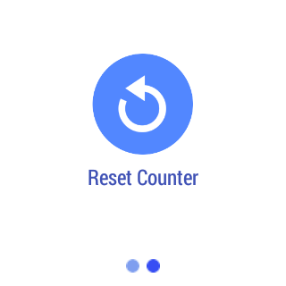

# Jumping Jack
This sample demonstrates the use of the gravity sensor in the Android Wear device through a counter for jumping jacks that the user makes while wearing the device. Note: the jumping jacks must be fairly quick (2 seconds or less) for the jumping jacks to count. The counter can be reset from the settings screen accessed by swiping left.

## Instructions
* Deploy the wearable project onto an Android Wear device.
* The first page will count the number of jumping jacks you do.
* The second page (reached by swiping left) will contain a button allowing you to reset the counter.

## Build Requirements
Xamarin Studio 5.3+
Xamarin.Android 4.17+

## Author
Copyright (c) 2005-2008, The Android Open Source Project  
Ported to Xamarin.Android by John Pilczak
