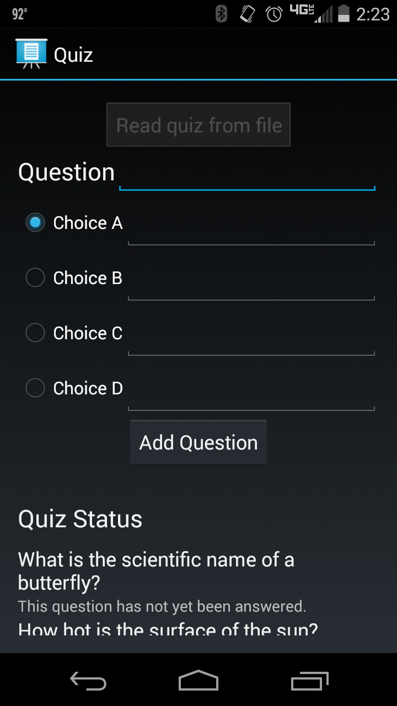

# Quiz
This wearable sample demonstrates how to create a quiz between the watch and the mobile device. The phone app will allow you to either create a custom quiz or load questions from a file. Once a question is added, the wearable device will display the question and allow the user to answer by tapping the page of the notification that appears that they think is the right answer.

## Instructions
* Create a quiz on the phone app by either tapping the “Read quiz from file” button or by filling in the blanks with your own question and selecting the correct answer’s radio button then pressing the “Add question” button.

* Answer questions made on the phone app by swiping until you see the answer you think is correct and tapping that answer. The question will turn either green or red on the phone app showing whether you are right or wrong.

* “Reset Quiz” will reset the current completed quiz

* “New Quiz” will clear all current questions allowing you to create a completely new quiz

## Build Requirements
This app requires both a wear device and a phone/tablet that is api level 18+ to run. You also need Xamarin.Android 4.17 or later.

## Author
Copyright (c) 2005-2008, The Android Open Source Project  
Ported to Xamarin.Android by John Pilczak