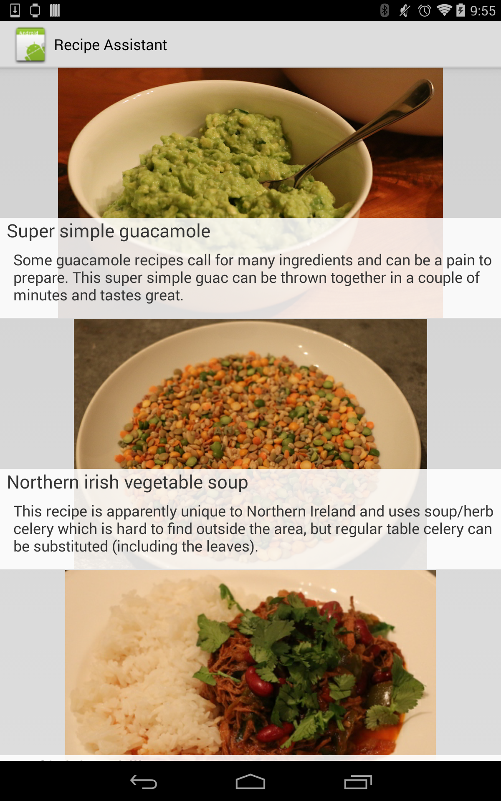

# RecipeAssistant
This sample demonstrates sending a list of notifications pages to an Android Wear device, with each page describing a step in a recipe. The actual creation of the notification is done in RecipeService.cs.

## Instructions
* Deploy the RecipeAssistant project to a physical Android device that is 4.3 Jelly Bean or above.
* Pick a recipe from the app to send to the wearable device
* The wearable device will recieve a multi-page notification with a page for each step of the recipe. You can move on to the next page by swiping left on the device.

## Build Requirements
Xamarin Studio 5.3+  
Xamarin.Android 4.17+

## Author   
Copyright (c) 2005-2008, The Android Open Source Project  
Ported to Xamarin.Android by Christopher Blackman
