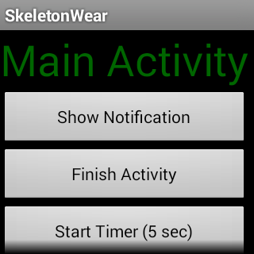

# SkeletonWear

This sample shows the basic outline of a wearable project including Gridviews on Wearable devices and interactive notifications.

## Build Requirements

Xamarin Studio 5.3+  
Xamarin.Android 4.17+

## License

Copyright (c) 2005-2008, The Android Open Source Project  
