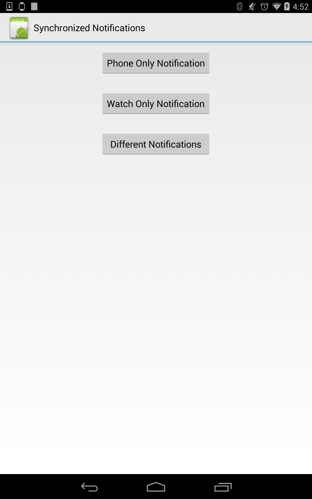

# SynchronizedNotifications
This wearable sample demonstrates using listener services to create three kinds of notifications; a phone only notification, a wearable only notification, and a notification that appears on both the phone and wearable, with one automatically disappearing when the other is dismissed.

## Instructions
* Deploy the SynchronizedNotifications project to a 4.3 Jelly Bean or higher Android device and the Wearable project to an Android Wear device.
* Choose an item from the list to send notifications to the listed devices.

## Build Requirements
Xamarin Studio 5.3+  
Xamarin.Android 4.17+

## Author   
Copyright (c) 2005-2008, The Android Open Source Project  
Ported to Xamarin.Android by Christopher Blackman
