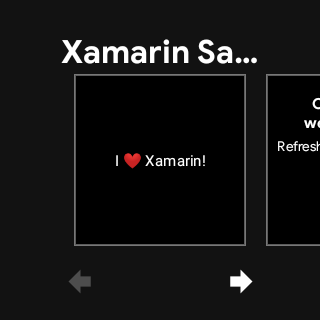

# WatchTile

**WatchTile** is a sample to show a string on the tile screen.

To run the watch tile:

1. Build and deploy the solution to the Wear device.

2. Swipe right to open the tile.

3. Press down for a second to enter the watch tile picker.

4. Swipe until you see the **Xamarin Sample** watch tile.

5. Tap to select the **Xamarin Sample** watch tile.

# Requirements
- Binding library `androidx.wear.tiles:1.0.0-alpha11+`.
- Using the Tiles API requires targeting API level 26 or higher.

# Screenshots

